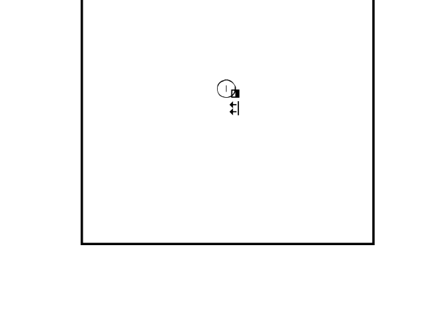

# SignWriting Fonts

## SuttonSignWritingOneD.ttf

The SignWriting One-Dimensional font is a font that can be used to display SignWriting in a single line of text.
Created by Stephen Slevinski, it is available for download [here](https://github.com/sutton-signwriting/font-ttf),
and mirrored in this repository at [fonts/SignWritingOneD.ttf](fonts/SignWritingOneD.ttf).


## SuttonSignWritingTwoD.ttf

The SignWriting Two-Dimensional font is a font that can be used to display SignWriting in a two-dimensional grid.
This is designed for use cases where TTF fonts are supported, but SVG images are not, such as video captioning.

Created by this project, it is available for download at [fonts/SuttonSignWritingTwoD.ttf](fonts/SuttonSignWritingTwoD.ttf).



### Recreating the Font

```bash
brew install harfbuzz
pip install .[dev]
make fonts/SuttonSignWritingTwoD.ttf
```

### How was it created?

To draw SignWriting in a two-dimensional grid, [font-ttf](https://github.com/sutton-signwriting/font-ttf) provides 
two additional fonts - `SuttonSignWritingFill` and `SuttonSignWritingLine`. 
These fonts are used to draw the fill and line of each glyph, respectively.

1. [TODO] The Glyphs in `SuttonSignWritingFill` and `SuttonSignWritingLine` were extracted and combined into a single two-tone TTF font.
2. [TODO: LRB] Non-visual glyphs (such as Boxes, and Positions) were removed from the font.
3. [TODO] The font was optimized by only including a single copy of each base hand shape, 
   and using rotations and mirroring to draw the other hand shapes.
4. [TODO] Using ligatures, an `M` box defines the size of the grid, and an anchor point.
   The anchor point is used to position the glyphs in the grid.
5. [TODO] All glyphs (grouped in 4 groups due to TTF limitations) combine with two positional glyphs to create an 
   Orthogonal translation of the glyph in the grid.

