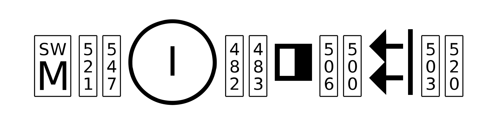
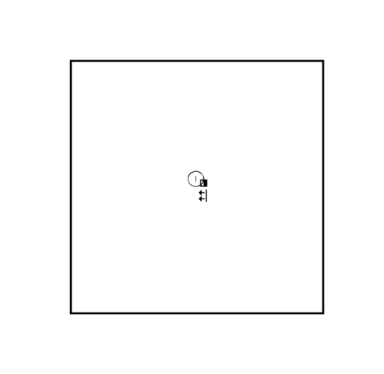

# SignWriting Fonts

## Development setup

```bash
brew install fontforge harfbuzz
pip install .[dev]
```

## SuttonSignWritingOneD.ttf

The SignWriting One-Dimensional font is a font that can be used to display SignWriting in a single line of text.
Created by Stephen Slevinski, it is available for download [here](https://github.com/sutton-signwriting/font-ttf),
and mirrored in this repository at [fonts/SignWritingOneD.ttf](fonts/SignWritingOneD.ttf).



### Regenerating a 1D font from font-db sources (issue #1)

The Sutton TTFs are built by FontForge from cubic-Bezier SVG sources; the cubic
curves are approximated as quadratics during TTF generation, which introduces
shape drift. To stay closer to the source we rebuild the 1D font from
[`@sutton-signwriting/font-db`][fontdb]'s cubic SVGs directly.

```bash
make fonts/SignWritingOneD.ttf
```

The pipeline:

1. **`signwriting_fonts/font_1d/extract.py`** reads `fonts/tmp/iswa2010.db` (the
   font-db SQLite blob, fetched by the Makefile) and writes one SVG per symbol
   into `fonts/tmp/1d/svg/`. The `sym-fill` (white-interior) path is dropped — 1D
   glyphs are monochrome.
2. **`signwriting_fonts/font_1d/optimize.py`** detects circular sub-paths via
   LSQ circle fit (robust to one outlier) and replaces them with a 4-segment
   cubic-Bezier ellipse (~0.027 % radius error). This both shrinks the path
   data and removes hand-traced wobble.
3. **`signwriting_fonts/font_1d/build_font.py`** is a FontForge Python script
   that creates one glyph per SVG, maps each to its plane-4 SWU codepoint, and
   emits the final TTF. No GSUB/GPOS layout step is needed — outline-level
   composite-glyph dedup is the entire size win.

By default the extractor pulls every symbol in `iswa2010.db`. Pass
`--symbols S100 S200 …` (or `--symbols dev` for the hand-picked dev subset
in `extract.py`) to restrict the build for fast iteration.

[fontdb]: https://github.com/sutton-signwriting/font-db

## SuttonSignWritingTwoD.ttf

The SignWriting Two-Dimensional font is a font that can be used to display SignWriting in a two-dimensional grid.
This is designed for use cases where TTF fonts are supported, but SVG images are not, such as video captioning.

Created by this project, it is available for download at [fonts/SuttonSignWritingTwoD.ttf](fonts/SuttonSignWritingTwoD.ttf).



### Recreating the Font

```bash
make fonts/SuttonSignWritingTwoD.ttf
```

The build has no Perl/CPAN dependency anymore — `pip install .[dev]` covers the GPOS compile step. (`make` itself still shells out to `ttx`, `hb-view`, and `wget` for the surrounding pipeline.)

### How it works

SignWriting's 2D layout encodes each positioned symbol as a 3-codepoint
cluster: `<symbol Sxxxxx><x-position SW{x}><y-position SW{y}>`, with
`x, y ∈ [250, 749]` and `SW750` as the M-box origin. The font's job is
to read the `SW{x} SW{y}` markers and shift the preceding symbol by
`(x - 750, 750 - y)`.

1. **Glyph source.** `signwriting_fonts/font_2d/modify_ttx.py` round-trips
   `SuttonSignWritingOneD.ttf` through TTX to fix naming, replace the M
   marker with a 500×500-unit box, drop the number glyphs (used here as
   position markers only), and scale every symbol to fit inside the
   M-box.
2. **Axis-decomposed GPOS.** `signwriting_fonts/font_2d/add_gpos.py`
   adds the positioning table directly via fontTools. Instead of one
   lookup per `(x, y)` pair (which would be 500 × 500 = 250 000 rules
   and exceed every OT-table size limit), positioning is split into
   independent X and Y axis rules that stack via standard GPOS
   accumulation:
   - one chained-context lookup per X coordinate matching `<symbol> SW{x}
     <any-marker>` and shifting by `(x - 750, 0)`;
   - one chained-context lookup per Y coordinate matching `<symbol>
     <any-marker> SW{y}` and shifting by `(0, 750 - y)`.

   The full symbol range (`S10000`–`S38b07`, ~37 800 glyphs) is split
   into three input partitions because harfbuzz silently drops a
   chained-context lookup whose input coverage exceeds ~32 k glyphs.
   Every lookup is then wrapped in a `LookupType 9` extension so the
   `LookupList` stays addressable by uint16 offsets.

   `--coords "425-574"` is the default (150 X values × 150 Y values =
   22 500 addressable positions), which covers every coordinate the
   typical SignWriting corpus uses while staying inside fontTools'
   `LookupList` packing limits. Pass `--coords "250-749"` for the full
   range once `LookupList` overflow is handled (TODO).
