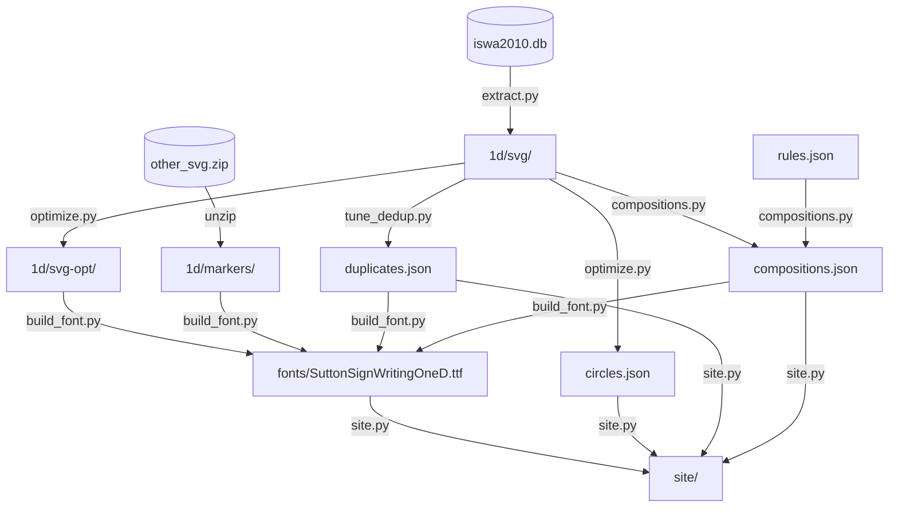

# SignWriting 1D — font rebuild from font-db cubic sources

This package rebuilds `SuttonSignWritingOneD.ttf` from
[`@sutton-signwriting/font-db`][fontdb]'s cubic-Bezier source SVGs and
deduplicates the ~38k glyph outlines using **TrueType composite glyphs**
(rotation/reflection of hand variants + multi-part compositions of face
glyphs as `head + marker`). Result: visually faithful to the upstream
font, 43% smaller on disk, with structure that's auditable in the
generated symbol explorer.

## Pipeline



The dedup is **outline-level**, not text-shaping-level: each composite
glyph in the `glyf` table stores a reference to another glyph + a 2×2
affine transform. No GSUB/GPOS involved, so the base TTF is the
shippable font — no VOLT/`volt2ttf` step.

## Building

```bash
brew install fontforge harfbuzz
pip install .[dev]

make all          # extract → optimize → JSONs → TTF → site
make clean        # rm -rf fonts/tmp/
```

Default target rebuilds the symbol-explorer website end-to-end. Build
inputs and intermediates all live under `fonts/tmp/`; only the final
`fonts/SuttonSignWritingOneD.ttf` lands in the tracked `fonts/` directory.

## Symbol explorer

```bash
make serve        # http://localhost:8000
```

Pages:
- `index.html` — 652 base symbols grouped by the seven ISWA-2010 categories.
- `S{base}.html` — one page per base, 16×16 fill × rotation grid.
- `about.html` — file-size impact, dedup categories, hover examples.

Decoration:
- Orange fill = glyph is a D4 dedup composite (rotation/reflection of a base).
- Green fill = glyph is a multi-part rule composition.
- Green border = glyph contains ≥1 approximately-circular sub-path.

Hovering any cell shows its base, transform, and parts as mini-renders.
A sticky toggle in the header compares the new font against the upstream
OneD font side-by-side.

### Live reload

`make serve` writes a `version.txt` timestamp on each rebuild; the pages
poll it every 2s and hard-reload on change.

```bash
# Terminal 1
make serve

# Terminal 2 — rebuild on source change (needs `brew install fswatch`)
make watch
```

## Pending work

### Rule families not yet covered

- **S300–S306** head movement/direction — no standalone arrow base in
  source to compose from; would need automatic arrow-shape extraction.
- **S321–S329** eyegaze — fills lack a head ring; need a separate
  "eyegaze base" abstraction we don't have.
- **S337, S338** air-rotation (8 rotations).
- **S339, S33a** breath — same shape at different sizes across fills
  (scale-only, not expressible in current rules).
- **S356–S358** mouth corners/wrinkles — different marker per fill
  rather than left/right halves.
- **S359–S35e** tongue (with rotations); **S35f, S360** tongue centre.
- **S361–S367** teeth — multiple variant markers per family.
- **S368, S369** jaw movement; **S36a** neck.
- **S36b, S36c** hair/excitement — 4-fill pattern, structure TBD.
- **S22f, S234 ← S22a** — sub-path count = 1, likely a scale variant,
  not an N-copy. Out of scope for the current multiples mechanism.

### Families covered but with caveats

- **S31a, S31e, S31f** eyes — high bbox-size variance in the source;
  matcher tolerances let them resolve but centering may drift.
- **S317, S318** eye-blink — source draws (arc + V) with different
  topology in fill-4 vs fill-3.
- **S33100** — fails the resolver despite siblings S332/S333/S334 working.
- **S33c, S34c** — mouth-simple bases that fail the resolver.
- **S32a–S32f** cheeks, **S330** ears — head ring is hand-modified
  with cheek-bumps built in; can't decompose without transforming the
  head shape itself. Skip.

### Fixes / audits

- Verify S31a00 eyes are centred (delta to head-cx ≤ 1 px) after the
  composed-bbox fix in `_center_axis_font`.
- Survey all eye groups for centring drift — only S31a was flagged.
- Audit whether any base outside `S37f`/`S380` is a clean 8-fold
  rotation family (`tune_dedup.py` would pick those up automatically).
- Eye overlay-equality test for S31a once centering is verified.
- S307 mirror-column invariant test.

[fontdb]: https://github.com/sutton-signwriting/font-db
